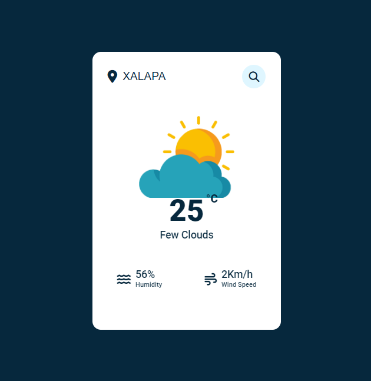
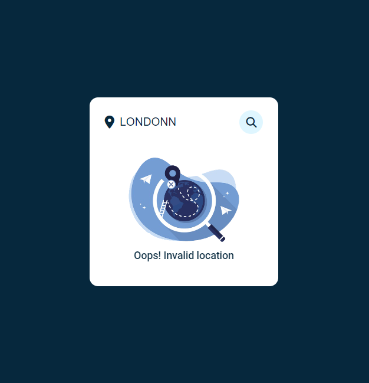

### Project - Wheater App

A simple and intuitive weather application that provides current weather information for any location.

## Features

- **Real-time Weather Data**: Get up-to-date weather information, including temperature, humidity, wind speed, and more.
- **Location-based Forecast**: Automatically fetch weather forecast for your current location or search for weather in any specific location.
- **Multiple Units**: Toggle between different units of temperature (Celsius, Fahrenheit) and wind speed (m/s, mph, km/h).
- **Weather Icons**: Visualize weather conditions with a set of beautiful icons.
- **Responsive Design**: Enjoy a seamless weather experience across different devices and screen sizes.
- **Minimalist Interface**: Focus on the essential weather information without any clutter.

## Screenshots

