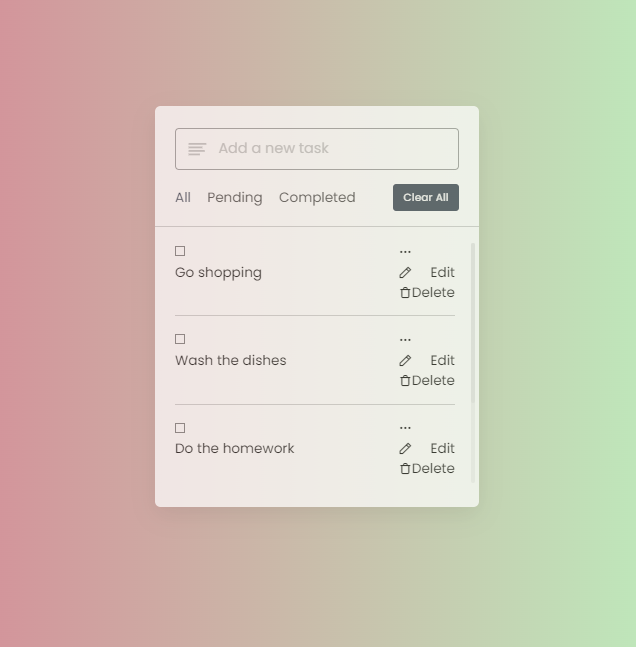

### Project - To-Do List App

To-Do List App is a simple and intuitive task management application designed to help you stay organized and productive. With an elegant user interface and powerful features, managing your daily tasks has never been easier.

## Features

- **Create and edit tasks**: Easily add new tasks and edit existing ones with just a few clicks.
- **Priority Levels**: Assign priority levels to your tasks to prioritize your to-do list.
- **Multiple Units**: Toggle between different units of temperature (Celsius, Fahrenheit) and wind speed (m/s, mph, km/h).
- **Search and Filter**: Quickly find tasks using the search bar or filter tasks by priority or category.

## Screenshots

