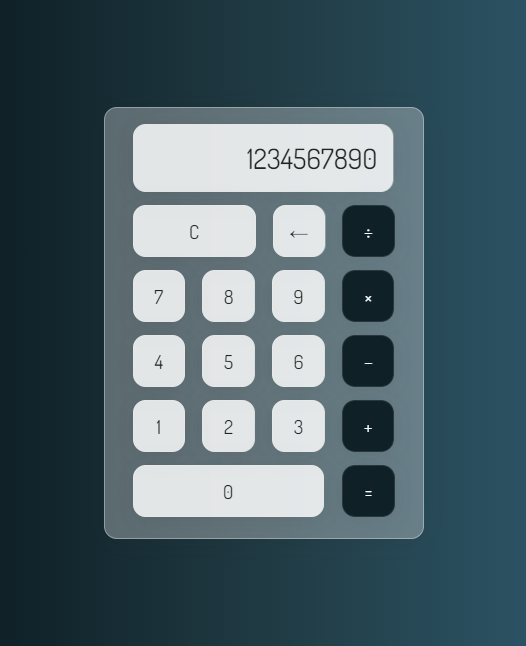

### Project - Calculator

This is a basic web-based calculator application built with JavaScript, HTML, and CSS. It allows users to perform common arithmetic operations, such as addition, subtraction, multiplication, and division, quickly and efficiently within their web browser.

## Features

- **User-Friendly Interface**: The calculator has a clean and intuitive user interface, making it easy for users to input and calculate mathematical expressions.
- **Basic Arithmetic Operations**: It supports addition, subtraction, multiplication, and division, making it suitable for everyday calculations.
-**Error Handling**: The calculator handles common errors, such as division by zero, and provides meaningful error messages to the user.
-**Responsive Design**: The calculator is designed to work well on both desktop and mobile devices, ensuring a seamless user experience across different screen sizes.

## Screenshots

