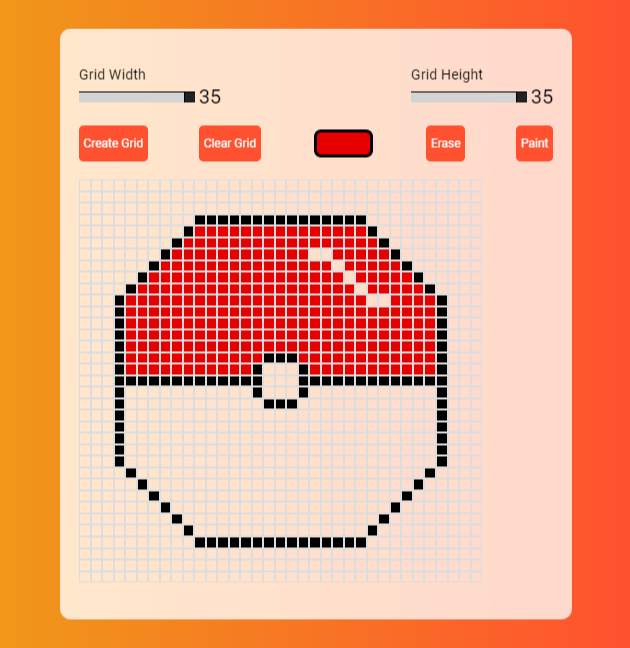

### Project - Pixel Art Generator

Welcome to the Pixel Art Generator project, a creative and fun web application built using HTML, CSS, and JavaScript! This project was born out of a passion for pixel art and the desire to provide a user-friendly platform for both beginners and experienced artists to create pixel masterpieces with ease.

## Features

- **Intuitive Pixel Canvas**: The pixel art generator provides a user-friendly canvas where you can unleash your creativity one pixel at a time. Choose from a palette of vibrant colors to paint your digital canvas.
- **Custom Canvas Size**: Tailor your canvas size to fit the scale of your artistic vision. Whether it's a tiny 16x16 icon or a 35x35 game sprite, our tool adapts to your needs.
-**Color Picker**: Easily select and switch between colors to add depth and variety to your pixel art creations. Experiment with different shades to achieve the desired effects.
-**Responsive Design**: The Pixel Art Generator is designed to work seamlessly on both desktop and mobile devices, so you can create art wherever and whenever inspiration strikes.

## Screenshots

