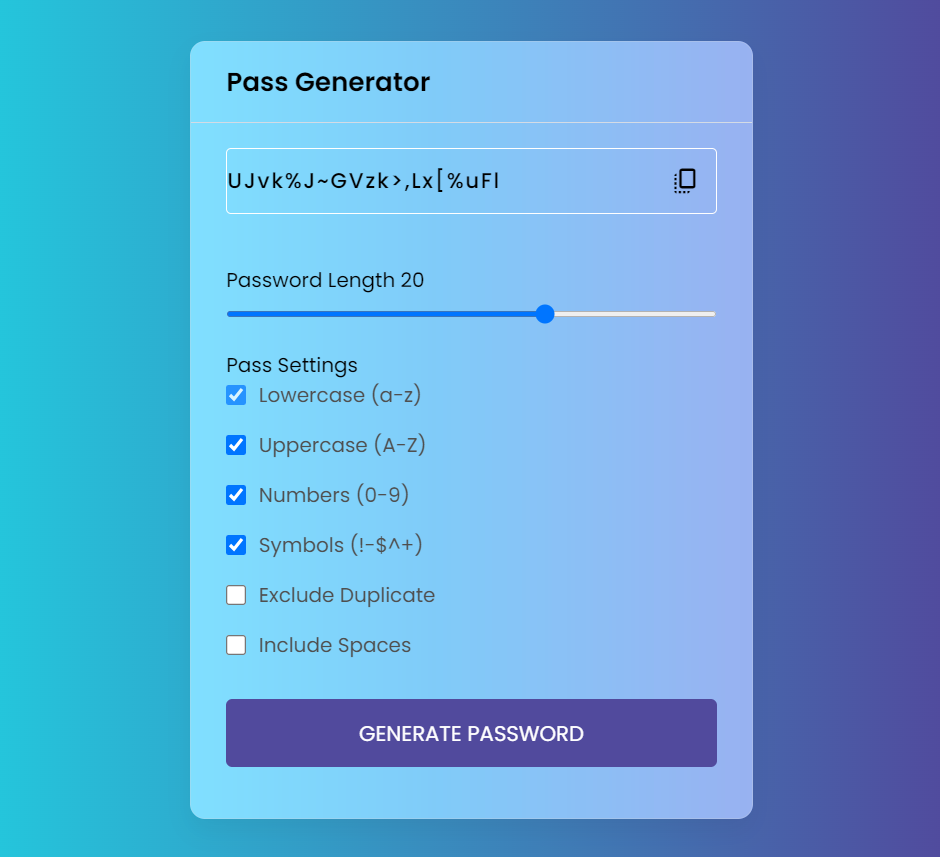

### Project - Password Generator

This Password Generator project is a dynamic and user-friendly web application designed to help users generate strong and secure passwords effortlessly. Built using HTML, CSS, and JavaScript, it serves as an excellent addition to my portfolio, demonstrating my skills in front-end web development and usability design.

## Features

**Password Customization:**: Users can tailor their passwords by selecting various criteria such as password length, including uppercase letters, numbers, and special characters.

**User-Friendly Interface**: The intuitive user interface makes it easy for users to generate passwords with just a few clicks, even if they have limited technical knowledge.

**Copy to Clipboard**: Users can quickly copy the generated password to their clipboard with a single click for easy use.

## Technologies Used

**HTML**: Provides the basic structure and content of the web page.

**CSS**: Enhances the visual appeal and styling of the application, making it user-friendly and responsive.

**JavaScript**: Powers the functionality of the password generator, enabling real-time updates based on user selections.

## Screenshots

