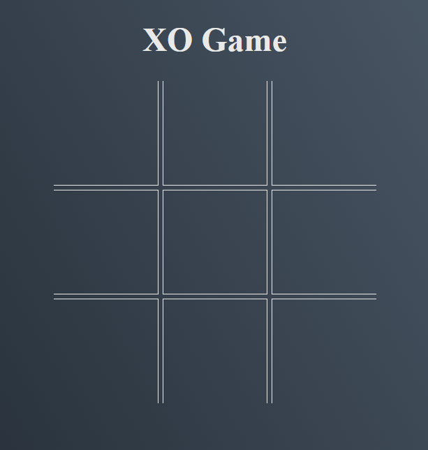
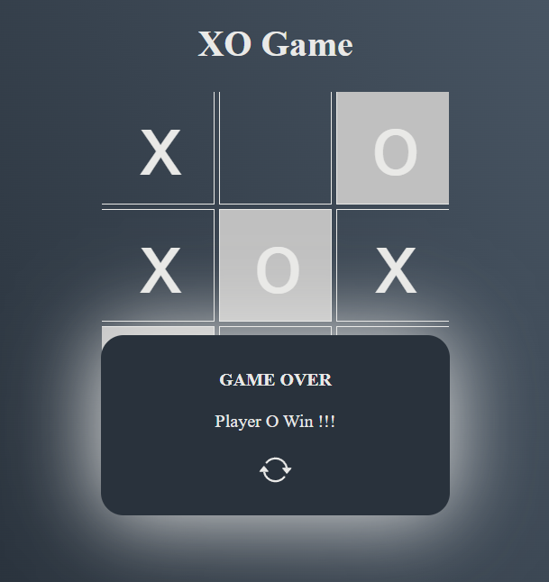

### Project - XO Game (Tic-Tac-Toe)

The XO Game project is a classic implementation of the timeless Tic-Tac-Toe game, brought to life through HTML, CSS, and JavaScript. As a part of my portfolio, this project showcases my skills in web development and game design, offering a fun and engaging experience for players of all ages.

## Features

**Classic Gameplay:**: Experience the familiar and enjoyable gameplay of Tic-Tac-Toe, suitable for players of all skill levels.

**Two-Player Mode**:  Play against a friend locally in a head-to-head battle of Xs and Os.

**Responsive Design**: The game is responsive and works seamlessly on both desktop and mobile devices, ensuring an optimal gaming experience for all players.

## Technologies Used

**HTML**: Provides the structure and layout of the game board and user interface.

**CSS**:  Enhances the visual presentation, making the game visually appealing and easy to navigate.

**JavaScript**: Powers the game's logic, handling player moves, determining wins, and updating the score.

## Screenshots

